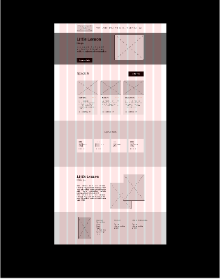
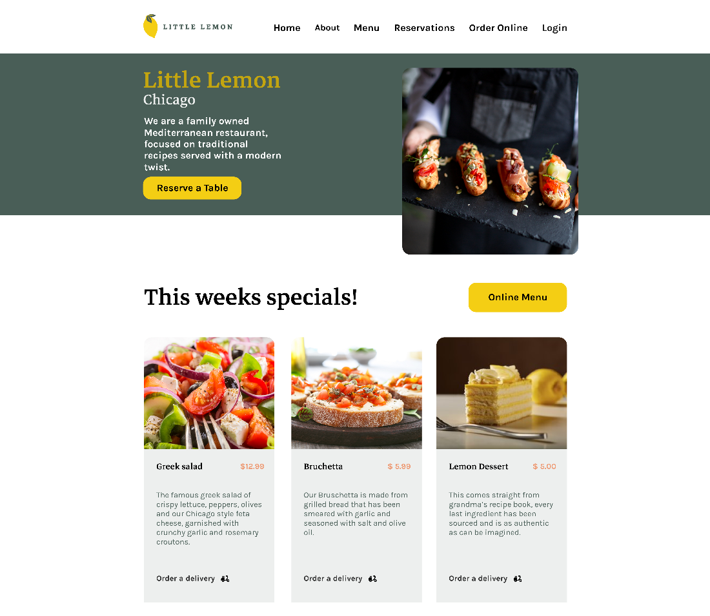
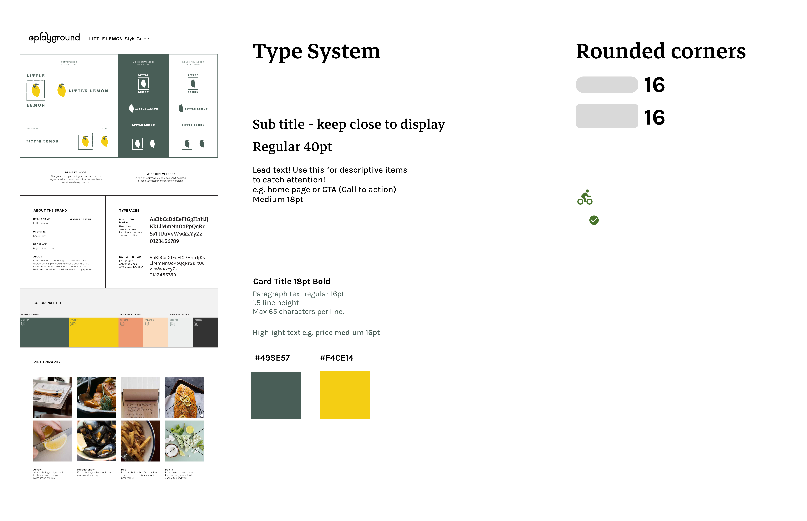
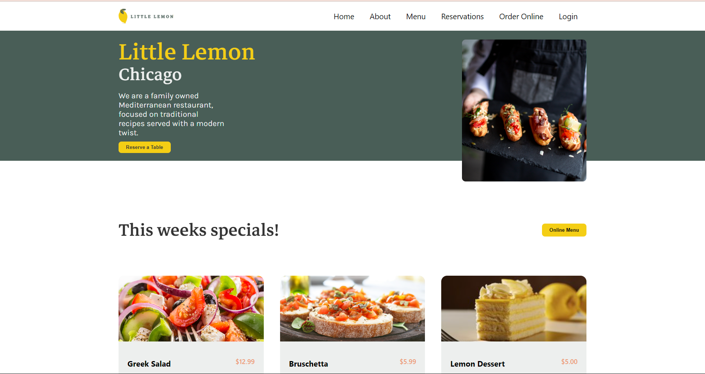
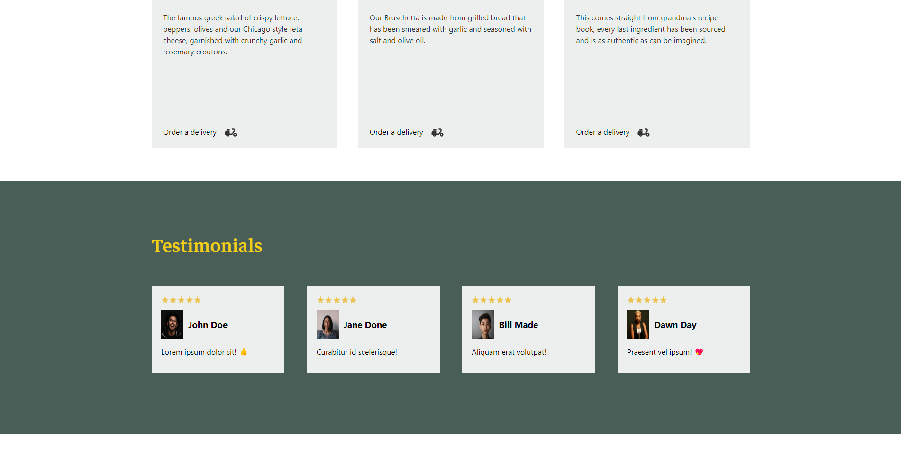
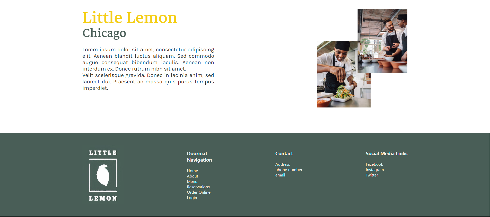
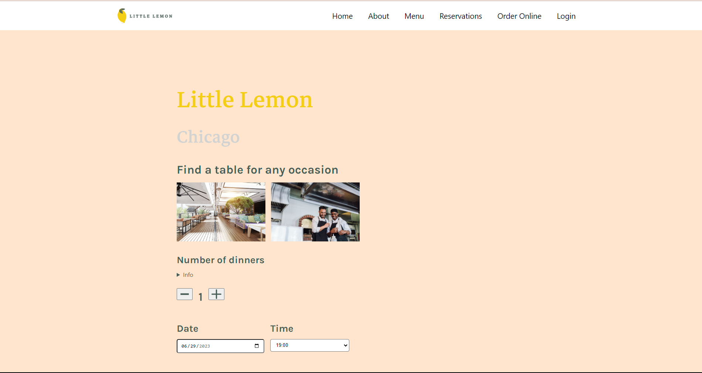
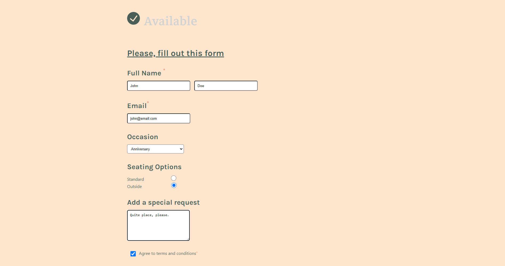

# Little Lemon Website to reserve a table

## How to use it?
- You must have Node.js, npm or yarn installed on your system.

1. You can either download the project by clicking on the green button and select _**Download**_, or Clone this repo to your local machine by running: `git clone https://github.com/aliaformo/littlelemon-app.git`
2. Then navigate to the directory `cd littlelemon-app`
3. Make sure you're in this folder. Once in the working directory, you'll see the package.json file, then run the `npm install` command to install all dependencies and create the `node_modules` folder at your end.
4. Finally, run the `npm start` command to see the website and make your reservation.

## UX Design Guide

- Wireframe

- Prototype

## UX Design

## Final result (Website image)
- Landing page

- Reservation page

