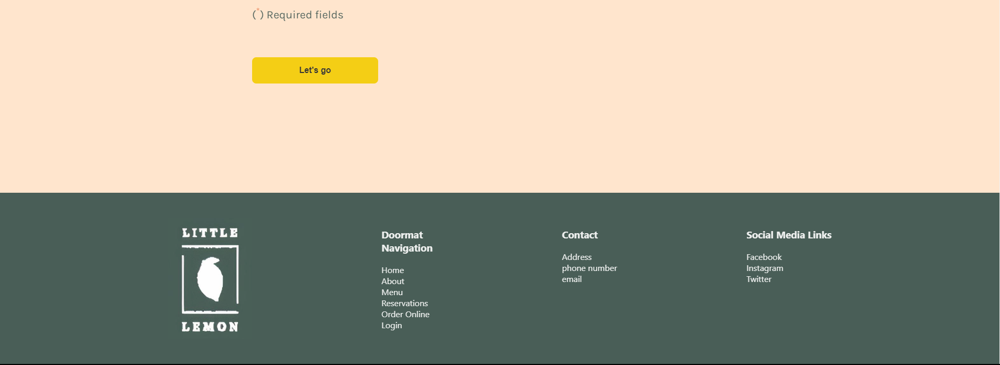

# Little Lemon Website to reserve a table

## How to use it?

1. Clone or download this repo, and run the `npm install` to install all dependencies and create the node modules folder at your end.
2. Then run the `npm start` command to see the website.

## UX Design Guide

- Wireframe

- Prototype

## UX Design

## Final result (Website image)
- Landing page

- Reservation page

